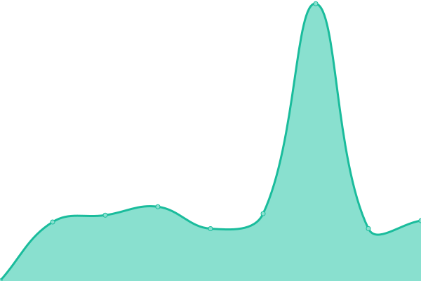

# [📈 Live Status](https://demo.upptime.js.org): <!--live status--> **🟩 All systems operational**

This repository contains the open-source uptime monitor and status page for [Pixium Digital](https://pixiumdigital.com), powered by [Upptime](https://github.com/upptime/upptime).

With [Upptime](https://upptime.js.org), you can get your own unlimited and free uptime monitor and status page, powered entirely by a GitHub repository. We use [Issues](https://github.com/pixiumdigital/uptime/issues) as incident reports, [Actions](https://github.com/pixiumdigital/uptime/actions) as uptime monitors, and [Pages](https://demo.upptime.js.org) for the status page.

<!--start: status pages-->
<!-- This summary is generated by Upptime (https://github.com/upptime/upptime) -->
<!-- Do not edit this manually, your changes will be overwritten -->
<!-- prettier-ignore -->
| URL | Status | History | Response Time | Uptime |
| --- | ------ | ------- | ------------- | ------ |
|  [Aeqlia Platform](https://app.aeqlia.com/ping.html) | 🟩 Up | [aeqlia-platform.yml](https://github.com/pixiumdigital/uptime/commits/HEAD/history/aeqlia-platform.yml) | 

 676ms
     
 | 

<a href="https://pixiumdigital.github.io/uptime/history/aeqlia-platform">100.00%</a>
    

|  [Boldly](https://live.boldly.app/ping.html) | 🟩 Up | [boldly.yml](https://github.com/pixiumdigital/uptime/commits/HEAD/history/boldly.yml) | 

 888ms
     
 | 

<a href="https://pixiumdigital.github.io/uptime/history/boldly">98.73%</a>
    

|  [Kaminoo](https://app.kaminoo.com/ping.html) | 🟩 Up | [kaminoo.yml](https://github.com/pixiumdigital/uptime/commits/HEAD/history/kaminoo.yml) | 

 758ms
     
 | 

<a href="https://pixiumdigital.github.io/uptime/history/kaminoo">100.00%</a>
    

|  [GMC](https://gomastercoach-app.com) | 🟩 Up | [gmc.yml](https://github.com/pixiumdigital/uptime/commits/HEAD/history/gmc.yml) | 

 1189ms
     
 | 

<a href="https://pixiumdigital.github.io/uptime/history/gmc">100.00%</a>
    

|  [Pixium Digital](https://pixiumdigital.com) | 🟩 Up | [pixium-digital.yml](https://github.com/pixiumdigital/uptime/commits/HEAD/history/pixium-digital.yml) | 

 1591ms
     
 | 

<a href="https://pixiumdigital.github.io/uptime/history/pixium-digital">100.00%</a>
    

|  [INDEFI](https://sofia.indefi.com) | 🟩 Up | [indefi.yml](https://github.com/pixiumdigital/uptime/commits/HEAD/history/indefi.yml) | 

 733ms
     
 | 

<a href="https://pixiumdigital.github.io/uptime/history/indefi">100.00%</a>
    

|  [LMO](https://app.lastmanout.club) | 🟩 Up | [lmo.yml](https://github.com/pixiumdigital/uptime/commits/HEAD/history/lmo.yml) | 

 825ms
     
 | 

<a href="https://pixiumdigital.github.io/uptime/history/lmo">100.00%</a>
    

<!--end: status pages-->

[**Visit our status website →**](https://demo.upptime.js.org)

## 📄 License

- Powered by: [Upptime](https://github.com/upptime/upptime)
- Code: [MIT](./LICENSE) © [Pixium Digital](https://pixiumdigital.com)
- Data in the `./history` directory: [Open Database License](https://opendatacommons.org/licenses/odbl/1-0/)
